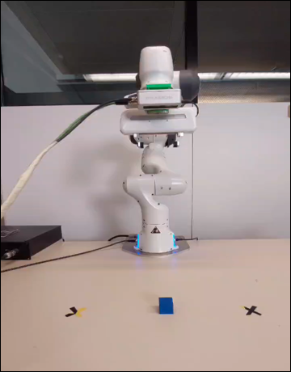

# Robotic Grasp Reliability Under Uncertainty
**Simulation → Real Hardware Analysis (Franka Emika Panda)**

This repository summarizes and reproduces key findings from my M.Sc. thesis on
**why robotic pick-and-place systems fail outside ideal conditions**.

The focus is not on achieving high average performance, but on identifying
**which uncertainties actually break grasp reliability in real robotic systems**.

---

## Motivation
Modern robots are increasingly deployed in human-centric, dynamic environments.
In these settings, small uncertainties compound into major failures.

Most systems over-optimize motion tuning.
This work shows **why perception accuracy and gripper calibration dominate real-world robustness**.

---

## System Overview
- Robot: Franka Emika Panda (7-DoF)
- Framework: ROS + MoveIt
- Simulation: Gazebo
- Perception: Depth camera (object pose estimation)
- Validation: Simulation results verified on real hardware

📌 *All experiments were designed to explicitly test where simulation assumptions fail on real robots.*

<!-- ADD IMAGE HERE -->

---

## Uncertainties Evaluated
Each source of uncertainty was injected independently and in combination:

- Object position uncertainty (X, Y)
- Gripper width uncertainty
- Velocity uncertainty
- Acceleration uncertainty
- Combined uncertainty scenarios

Uncertainty was modeled using probabilistic distributions and evaluated over
**50+ iterations per scenario**.

---

## Key Experimental Results

### 1️⃣ Object Position Uncertainty (Dominant Failure Driver)
Small perception errors cause a rapid drop in grasp success.

<!-- ADD IMAGE HERE -->

**Insight:**  
Perception error dominates failure more than motion noise.

---

### 2️⃣ Gripper Width Uncertainty (Disproportionate Impact)
Minor miscalibration leads to significant reliability loss.

<!-- ADD IMAGE HERE -->

**Insight:**  
Gripper calibration accuracy is more critical than aggressive motion tuning.

---

### 3️⃣ Motion Uncertainty (Velocity & Acceleration)
Isolated motion uncertainty is largely absorbed by modern controllers.

<!-- ADD IMAGE HERE -->

**Insight:**  
Velocity and acceleration noise have minimal isolated impact on grasp success.

---

### 4️⃣ Combined Uncertainty (Compounding Effect)
Multiple small uncertainties drastically reduce system-level reliability.

<!-- ADD IMAGE HERE -->

**Result:**  
Overall grasp success dropped to ~50% despite each uncertainty appearing tolerable alone.

---

## Key Engineering Findings
- Object position uncertainty is the **primary driver of grasp failure**
- Small gripper miscalibration produces **disproportionate reliability loss**
- Velocity and acceleration uncertainty are **largely absorbed in isolation**
- Multiple minor uncertainties **compound into major system-level failure**

---

## Practical Design Guidance
Based on real hardware validation:

- Prioritize **perception accuracy** over aggressive motion tuning
- Invest in **gripper calibration and tolerance analysis**
- Evaluate **combined uncertainty**, not parameters in isolation
- Validate simulation assumptions explicitly on real robots

---

## Why This Matters for Real Robots
These results directly apply to robots operating:
- Around humans
- In semi-structured environments
- With imperfect perception and calibration

This work highlights why **reliability engineering**, not just control performance,
is critical for deploying robots outside the lab.

---

## Next Steps
- Online perception uncertainty estimation
- Adaptive gripper calibration
- Learning-based robustness under compounding uncertainty
- Extension to human–robot interaction scenarios

---

## Contact
If you work on real robotic systems and care about robustness:
- LinkedIn: https://www.linkedin.com/in/nikita-majalikar-7a0277188/
